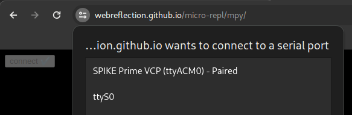

# micro-repl

<sup>**Social Media Photo by [Luca J](https://unsplash.com/@lucajns) on [Unsplash](https://unsplash.com/)**</sup>

An easy, SerialPort based, MicroPython REPL for micro controllers.

  * **[Live Board Demo](https://webreflection.github.io/micro-repl/board/)**
  * **[Live Xterm Demo](https://webreflection.github.io/micro-repl/xterm/)**
  * **[Live JS Demo](https://webreflection.github.io/micro-repl/)**
  * **[Live PyScript Demo](https://webreflection.github.io/micro-repl/mpy/)** which uses *MicroPython* on the browser to communicate with the *Spike* 🤯

Each demo has been successfully tested on both [Spike Prime](https://spike.legoeducation.com/prime/lobby/) and [Raspberry Pi Pico and Pico W](https://www.raspberrypi.com/documentation/microcontrollers/raspberry-pi-pico.html) ( <sup><sub>up to the `help()` it should work in other boards too</sub></sup> ).

- - -

## Features

There is a super *write and wait* core exported as `micro-repl` module and a full *REPL* mode exported as `micro-repl/x`.

The difference in offered features is the following one:

  * **micro-repl** provides a *Promise* based *API* with no way to intercept or interact with the code while it's executing. It's an extremely tiny `await board.write(python)` followed by an `await board.result`, or `board.output` ... and it does just that: perfect for little or one-off operations. **Note**: this initial *way-too-little* idea might be removed in the future!
  * **micro-repl/board** instead offers a full *REPL* ability through *Xterm.js*:
    * board `name` showed as soon as connected
    * fully interactive *REPL* mode out of the box
    * tab completion works out of the box too
    * every *Control+X* combination just works
    * pasting code also works
    * stopping running code via *Control+C* also works
    * safe (after prompt) reboot on *Control-D* when not inside a *paste mode* session
    * `ondata(buffer:Uint8Array)` passes along, while interacting, every single char the user is asking for
    * *AutoFit* and *WebLinks* plugins available out of the box
    * all imports are dynamic so it's size is still minimal before its usage

Please **note** `micro-repl/board` might become the main default export of this project.

## How To / Documentation

The easiest way to use `micro-repl/board` is via *CDN*:

```html
<script type="module">
  import Board from 'https://esm.run/micro-repl/board';

  const board = new Board({
    // all optionals
    baudRate: 9600, // defaults to 115200
    onconnect() { console.info('connected') },
    ondisconnect() { console.warn('disconnected') }
    onerror(error) { console.error(error) },
    ondata(buffer) { }
  });

  // to connect a board a user action/gesture is needed
  document.getElementById('repl').onclick = async event => {
    event.preventDefault();

    // connect the board to a DOM element to show the terminal
    await board.connect(event.target);
  };
</script>
<div id="repl"></div>
```

### micr-repl/board TS signature

Documented via JSDoc TS, these are all explicit TS details around this module's API.

#### options

These are all optional fields that can be passed when creating a new *Board*.

```ts
type MicroREPLOptions = {
  // default: 115200
  baudRate?: number | undefined;
  // default: console.error
  onerror?: ((error: Error) => void) | undefined;
  // default: () => void - notifies when the board is connected
  onconnect?: (() => void) | undefined;
  // default: () => void - notifies when the board is disconnected/lost
  ondisconnect?: (() => void) | undefined;
  // default: () => void - receives all data from the terminal
  ondata?: ((buffer: Uint8Array) => void) | undefined;
}
```

#### board

A *board* can be created via `new Board(options)` or just direct `Board(options)` ( <sup>which is more Pythonic</sup> ) and its returned reference is always an `instanceof Board`.

```ts
type MicroREPLBoard = {
  // `true` when connected, `false` otherwise
  @readonly connected: boolean;
  // the passed `baudRate` option
  @readonly baudRate: number;
  // the connected board name
  @readonly name: string;
  // the Terminal reference once connected
  @readonly terminal: xterm.Terminal;
  // ⚠️ must be done on user action !!!
  // connects the board and show the REPL in the specified `target`
  connect: (target: Element) => Promise<MicroREPLBoard | void>;
  // disconnect the board and invoke ondisconnect
  disconnect: () => Promise<void>;
  // soft-reset the board and put it back into REPL mode
  reset: () => Promise<void>;
  // write any string directly to the board
  write: (code: string) => Promise<void>;
}
```

Please note that `board.write(code)` requires `\r\n` at the end if you want your code to be executed.

Please also note this is not the same as `board.terminal.write(...)` because the terminal depends on writes on the board, not vice-versa.

- - -

<sup><sub>**WARNING**</sub></sup>

Please note this module is experimental. The current exports might change if actually the *board* is the best option this module offers (and I am definitively leading toward this conclusion).

- - -

#### micro-repl TS signature

Once a `repl` has been successfully initialized, it offers this *API*:

```ts
// The default export TS signature
({ baudRate, onceClosed, }?: {
    baudRate: number; // default: 115200
    onceClosed(error: Error | null): void;
}) => Promise<{
    readonly active: boolean;
    readonly result: Promise<string>;
    readonly output: Promise<string>;
    write: (code: string) => Promise<...>;
    close: () => Promise<...>;
}>
```

#### Signature description

  * **repl.active** as `boolean` - it's `true` when the *REPL* is active and running, `false` otherwise.
  * **repl.result** as `Promise<string>` - it contains the last line produced by the last executed code.
  * **repl.output** as `Promise<string>` - it awaits for the last executed code to execute and returns whatever that code produced, including the written code itself. Please note this throws an error if the `active` state is not `true`.
  * **repl.write(code)** as `(code:string) => Promise<void>` - it writes code to the boards' *REPL* and it fulfills after all code has been sent. Please note this throws an error if the `active` state is not `true`.
  * **repl.close()** as `() => Promise<void>` - it detaches all streams and gracefully clean up the `repl` state right before disconnecting it.

### Example

```js
// check the board status
repl.active; // true

// write code into the REPL
await repl.write('print("Hello MicroPython")');

// wait/check the produced REPL outcome
await repl.output;
/**
 * >>> print("Hello MicroPython")
 * Hello MicroPython
 */

// check the result (last printed line of the REPL)
await repl.result;  // "Hello MicroPython"

// disconnect the board
await repl.close();

// check the board status again
repl.active; // false
```

## Xterm.js REPL

The `micro-repl/x` variant brings in the mighty [Xterm.js](https://xtermjs.org/) to the mix, enabling a real-world *REPL* solution.

The main difference in its signature is that, due *Xterm.js* orchestration, there is no `result` and the `output` simply returns the content of the terminal.

There is the `terminal` instance exposed though, and the options on `init` accept an `onData(buffer:Uint8Array)` callback too.

#### micro-repl/x TS signature

```ts
// The default export TS signature
({ target, baudRate, onData, onceClosed, }?: {
    target: Element; // where to show the terminal
    baudRate: number; // default: 115200
    onData(buffer:Uint8Array): void;
    onceClosed(error: Error | null): void;
}) => Promise<{
    readonly name: string;
    readonly active: boolean;
    readonly terminal: Terminal;
    readonly output: string;
    write: (code: string) => Promise<...>;
    close: () => Promise<...>;
}>
```

### micro-repl/x Example

```html
<!DOCTYPE html>
<html lang="en">
<head>
  <meta charset="UTF-8">
  <meta name="viewport" content="width=device-width, initial-scale=1.0">
  <script type="module">
    import xtermInit from 'https://esm.run/micro-repl/x';

    const decoder = new TextDecoder;

    connect.onclick = async () => {
      connect.disabled = true;
      // bootstrap after user action
      const board = await xtermInit({
        target: repl,
        onData(buffer) {
          console.log(decoder.decode(buffer));
        },
        onceClosed(error) {
          connect.disabled = false;
          if (error) console.warn(error);
        }
      });

      // prints out the board name
      console.log(board.name);
    };
  </script>
</head>
<body>
  <button id="connect">connect</button>
  <div id="repl"></div>
</body>
</html>
```

### Troubleshooting

If you are on Linux and you can't see your *Prime* you can try to force-enable it by writing the following content into `/etc/udev/rules.d/50-myusb.rules`:

```
KERNEL=="ttyACM0",MODE="0666"
```

After a reboot, this instruction should enable it and you should see it selectable.



### Credits

This project has been inspired by [pyrepl-js](https://github.com/gabrielsessions/pyrepl-js) but because I think *React* and *TypeScript*, plus the rest of the logic, was a bit too much for a basic core *REPL*, I've decided to create a minimal *JS* standard module able to do pretty much the same in way less code to maintain. Feel free to use that project if you want a more rich *UI* around the connection, events instead of just promises to deal with unbuffered data as sent by the controller, and everything else in there which I didn't need to create those live demoes.
